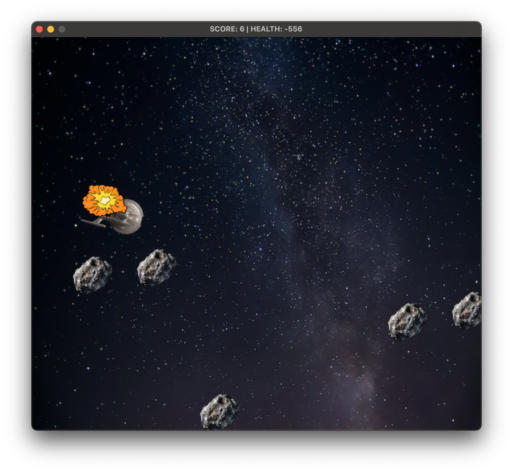

# Asteroids Game

## Submission for C++ Nanodegree Capstone




### How to Play

* Use arrow keys to move starship: :up_arrow:, :down_arrow:, :left_arrow:, and :right_arrow:
* Rotate the ship clockwise by pressing $\textcolor{orange}{D}$.
* Rotate the ship counterclockwise by pressing $\textcolor{orange}{A}$.
* To fire phaser blasts press the $\textcolor{orange}{space bar}$.

### Build the Project

#### Get the SDL2 dependencies.

On Ubuntu run
```
apt install libsdl2-dev libsdl2-image-dev libsdl2-ttf-dev
```

On Mac OS with [Homebrew](https://formulae.brew.sh/formula/sdl2)

```
brew install sdl2 sdl2_image sdl2_ttf
```
