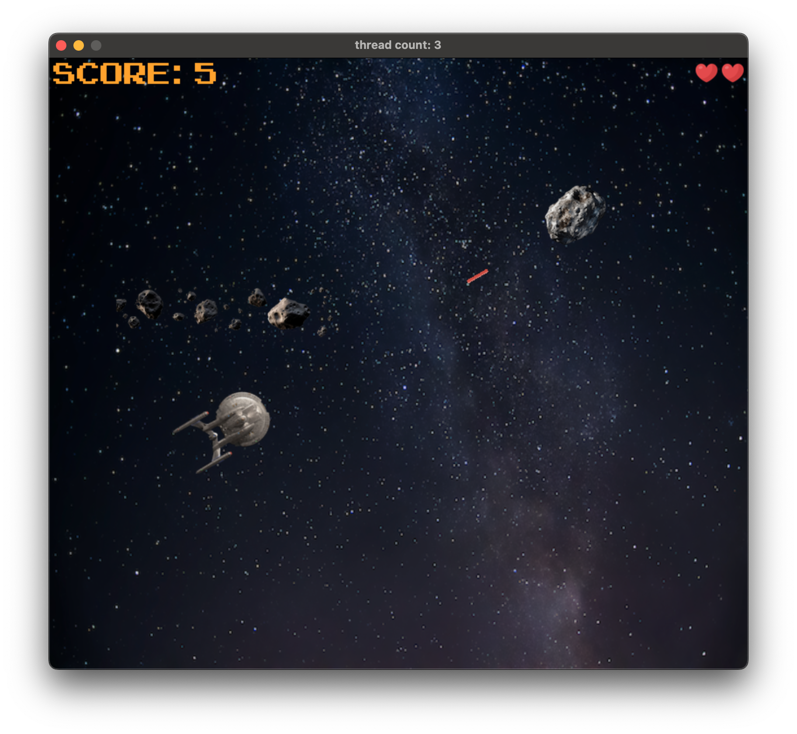
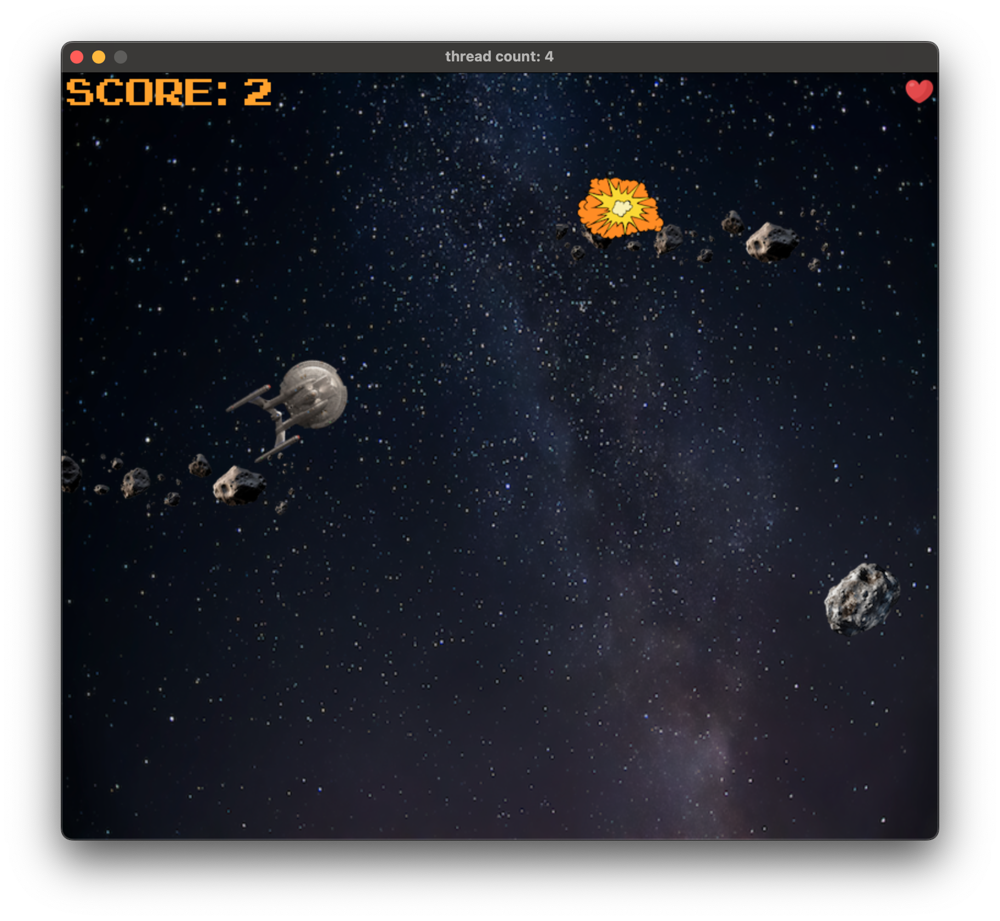

# Asteroids Game

### Submission for C++ Nanodegree Capstone




## How to Play

* Use arrow keys to move starship: :arrow_up:, :arrow_down:, :arrow_left:, and :arrow_right:
* Rotate the ship clockwise by pressing $\textcolor{orange}{D}$.
* Rotate the ship counterclockwise by pressing $\textcolor{orange}{A}$.
* To fire phaser blasts press the $\textcolor{orange}{space bar}$.

## Build the Project

#### Get the SDL2 dependencies.

On Ubuntu run
```
apt install libsdl2-dev libsdl2-image-dev libsdl2-ttf-dev
```

On Mac OS with [Homebrew](https://formulae.brew.sh/formula/sdl2)

```
brew install sdl2 sdl2_image sdl2_ttf
```

## Rubric Points Met

### Compiling and Testing

The project compiles in the Udacity workspace environment.

### Loops, Functions, I/O

| Criteria                                                                                 | Example                                                                                                                                                                                                                |
|------------------------------------------------------------------------------------------|------------------------------------------------------------------------------------------------------------------------------------------------------------------------------------------------------------------------|
| The project accepts user input and processes the input. | The `Controller` class handles user input. See for instance `Controller::doKeyDown`.                                                                                                                                   |
| The project reads data from a file and process the data, or the program writes data to a file. | The `Renderer` class reads texture files from the `/resources` directory. Specifically, in the member initialization list of constructor `Renderer::Renderer(const int h, const int w)`, line `137` of `Renderer.cpp`. |

### Object Oriented Programming

| Criteria                                                                                  | Example                                                                                                                                                              |
|-------------------------------------------------------------------------------------------|----------------------------------------------------------------------------------------------------------------------------------------------------------------------|
| Classes follow an appropriate inheritance hierarchy with virtual and override functions.  | `PhaserBlast`, `Asteroid`, `Player`, are all derived from an abstract class called `RenderableEntity`. Function `collidesWith` is overridden in the derived classes. |
| Class constructors utilize member initialization lists.                                   | All class constructors in the project use initialization lists. See, for example, the constructor defined on line `9` of `Game.cpp`.                                 |
| Templates generalize functions or classes in the project.                                 | Class `ThreadSafeQueue` wraps `std::queue<T>`; consequently, all of its member functions are templated.                                                              |

### Memory Management (4/6)

| Criteria                                                                                  | Example                                                                                                                                                                                                                                                                                                                  |
|-------------------------------------------------------------------------------------------|--------------------------------------------------------------------------------------------------------------------------------------------------------------------------------------------------------------------------------------------------------------------------------------------------------------------------|
| The project uses scope / Resource Acquisition Is Initialization (RAII) where appropriate. | `make_unique` and `make_shared` are used to create `PhaserBlast` and `Asteroid` entities, respectively. Additionally, `Asteroid` collision detection is run on threads managed by each `Asteroid` instance. Furthermore, collision detection threads are properly destructed when the Asteroids owning them are deleted. |
| The project follows the Rule of 5.                                                        | class `Asteroid` and `Explosion` defines all 5 constructors.                                                                                                                                                                                                                                                             |
| The project uses move semantics to move data instead of copying it, where possible.       | `PhaserBlast`, `Asteroid`, and `Explosion` entities are created and pushed into `ThreadSafeQueue` using move semantics. See line `30` of `Controller.cpp`.                                                                                                                                                               |
| The project uses smart pointers instead of raw pointers.                                  | `make_unique` and `make_shared` are used to create `PhaserBlast` and `Asteroid` entities, respectively.                                                                                                                                                                                                                  |

### Concurrency (2/4)

#### _Multithreading_

Threads are created in a few places.

* On line `102` of `Game.cpp`, Asteroids are spawned on a thread separate from main.  `Game::Spawn` is 
```c++
    // start asteroid spawning on its own thread.
    _threads.emplace_back(&Game::spawn, this, std::ref(renderer));
```

* In the function `Game::Spawn`, collision detection is started for each new asteroid on a thread owned / managed by the asteroid.

```c++
    /** Launch checkForCollision on its own thread.  */
void Asteroid::detectCollision(...) {
this->_thread = std::thread(&Asteroid::checkForCollision, this, phaserBlasts, explosions, player, running, isInsideWindow);
}
```

#### _Use of mutexes & locks_

* I defined `ThreadSafeQueue` to manage `PhaserBlast`, `Explosion`, and `Asteroid` collections. `ThreadSafeQueue` guarantees safe access by blocking access to the underlying queue with `lock_guard` and the mutex member `_mutex`. For example the `push` method,
```c++
template<typename T>
void ThreadSafeQueue<T>::push(T&& t) {
    std::lock_guard<std::mutex> lock(_mutex);
    _queue.emplace_back(std::move(t));
}
```
